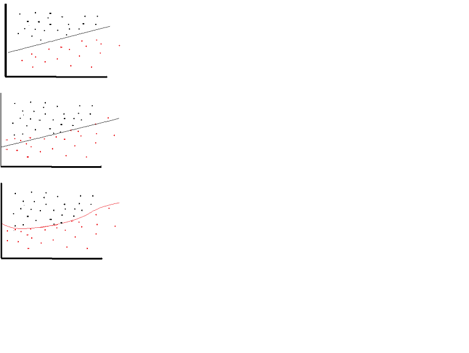

## Activation Function 
# Linear Activation Function



- A linear activation function can be use on very limited occasions. In fact to understand activation functions better it is important to look at the ordinary least-square or simply the linear regression. A linear regression aims at finding the optimal weights that results in minimal vertical effect between the explanatory and target variables, when combine with the input. In short if out expected output reflects the linear regression as shown below then linear activation functions can be used: (Top Figure).
- But in the in the second figure below linear function will not produce the desired results:(Middle figure)

# Non-Linear Activation function
- a non-linear function as shown below would produce the desired results:(Bottom figure)Activation functions cannot be linear because neural networks with a linear activation function are effective only one layer deep, regardless of how complex their architecture are. Input to networks are usually linear transformation (input * weight), but real world and problems are non-linear. To make the incoming data nonlinear, we use nonlinear mapping called activation function.

 

 # Commonly used activation functions in Machine Learning 
- Sigmoid or Logistic
- Tanh — Hyperbolic tangent
- ReLu -Rectified linear unit

# 1. Sigmoid
- It is a activation function of form f(x) = 1 / 1 + exp(-x) . Its Range is between 0 and 1. It is a S — shaped curve. It is easy to understand and apply but it has major reasons which have made it fall out of popularity -

    Vanishing gradient problem
    Secondly , its output isn’t zero centered. It makes the gradient updates go too far in different directions. 0 < output < 1, and it makes optimization harder.
    Sigmoids saturate and kill gradients.
    Sigmoids have slow convergence.
- What is the Vanishing Gradient Problem?

    when we do Back-propagation i.e moving backward in the Network and calculating gradients of loss(Error) with respect to the weights , the gradients tends to get smaller and smaller as we keep on moving backward in the Network. This means that the neurons in the Earlier layers learn very slowly as compared to the neurons in the later layers in the Hierarchy. The Earlier layers in the network are slowest to train.

    * Syntax
    ```
    import tensorflow as tf
    tf.sigmoid(x,name=None)
    """
    @Args:
    x: A Tensor with type float16, float32, float64, complex64, or complex128.
    name: A name for the operation (optional).
    @return:
    A Tensor with the same type as x

    ```

<http>https://medium.com/@anishsingh20/the-vanishing-gradient-problem-48ae7f501257</http>

# 2. Tanh
- tanh is also like logistic sigmoid but better. The range of the tanh function is from (-1 to 1). tanh is also sigmoidal (s - shaped).
- The advantage is that the negative inputs will be mapped strongly negative and the zero inputs will be mapped near zero in the tanh graph.

- The function is differentiable.

- The function is monotonic while its derivative is not monotonic.

- The tanh function is mainly used classification between two classes.

- Both tanh and logistic sigmoid activation functions are used in feed-forward nets. 
    * Syntax
    ```
    tf.tanh(x,name=None)
    """
    @Args:
    x: A Tensor or SparseTensor with type float16, float32, double, complex64, or complex128
    name: A name for the operation (optional).
    @Returns:
    A Tensor or SparseTensor respectively with the same type as x
    """
    ```

# 3. ReLU (Rectified Linear Unit) Activation Function

- The ReLU is the most used activation function in the world right now.Since, it is used in almost all the convolutional neural networks or deep learning.


- As you can see, the ReLU is half rectified (from bottom). f(z) is zero when z is less than zero and f(z) is equal to z when z is above or equal to zero.

- Range: [ 0 to infinity)

- The function and its derivative both are monotonic.

    But the issue is that all the negative values become zero immediately which decreases the ability of the model to fit or train from the data properly. That means any negative input given to the ReLU activation function turns the value into zero immediately in the graph, which in turns affects the resulting graph by not mapping the negative values appropriately.
    
    * Syntax
    ```
    tf.nn.relu(features,name=None)
    @Args:
    features: A Tensor. Must be one of the following types: float32, float64, int32, uint8, int16, int8, int64, bfloat16, uint16, half, uint32, uint64.
    name: A name for the operation (optional).
    @Returns:
    A Tensor. Has the same type as features.
    ```

# 4. Leaky ReLU
- Because of the horizontal line in ReLu( for negative X ), the gradient can go towards 0. For activations in that region of ReLu, gradient will be 0 because of which the weights will not get adjusted during descent. That means, those neurons which go into that state will stop responding to variations in error/ input ( simply because gradient is 0, nothing changes ). This is called dying ReLu problem.

- This problem can cause several neurons to just die and not respond making a substantial part of the network passive. There are variations in ReLu to mitigate this issue by simply making the horizontal line into non-horizontal component . for example y = 0.01x for x<0 will make it a slightly inclined line rather than horizontal line. This is leaky ReLu.

    * Syntax
    ```
    tf.nn.leaky_relu(features,alpha=0.2,name=None)
    """
    @Args:
    features :
    A Tensor representing preactivation values. Must be one of the following types: float16, float32, float64, int32, int64
    alpha: Slope of the activation function at x < 0.
    name: A name for the operation (optional).
    @Returns:
    The activation value.
    """

    ```

## ReLu is less computationally efficient than tanh and sigmoid because it involves simpler mathematical operations. That is a good point to consider when we are designing deep neural nets,but it only use for hidden layers the output layers should be softmax for classification and a linear function for regression

## relu6

- tf.nn.relu6 is similar to tf.nn.relu but it limits the maximum output to 6 this limitation reduces the likelihood of a node overreacting to large inputs.


## 
<http>https://towardsdatascience.com/activation-functions-neural-networks-1cbd9f8d91d6</http>
<http>https://medium.com/the-theory-of-everything/understanding-activation-functions-in-neural-networks-9491262884e0<http>
<http>https://en.wikibooks.org/wiki/Artificial_Neural_Networks/Activation_Functions</http>

<http>https://stats.stackexchange.com/questions/126238/what-are-the-advantages-of-relu-over-sigmoid-function-in-deep-neural-networks</http>


